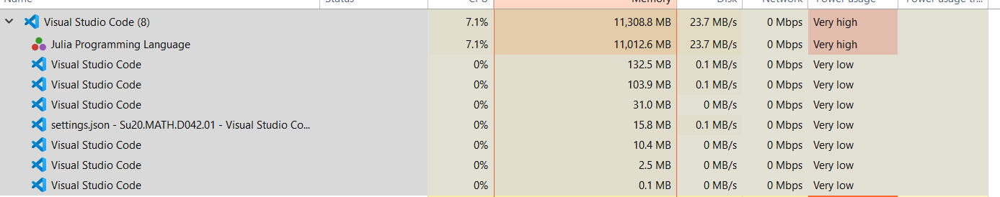

# Precalc II: Trig Functions

I started writing this in Julia.

A picture is worth 5,506,300,000 `WORD`s.

After the Julia thing, I tried Java, Kotlin, TypeScript, and JavaScript.
Ultimately, doing the work is the best on desmos so I'm abandoning this repo.
