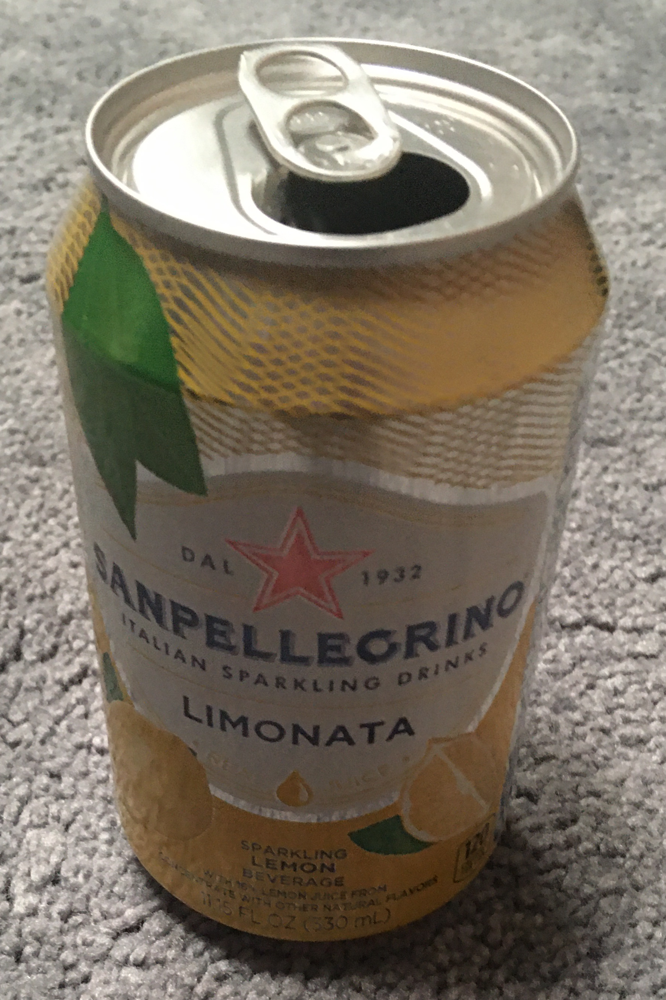

# introduction

Was originally assigned on `30 Jun 2020`.
This file was originally `2020.06.30.md`.

## response

Oh boy here we go.
I guess I'll just post my class post

Hi, everyone. My name's Cole and I've lived around the bay area for nearly my entire life.
I'm majoring in some sort of Computer Science but I've got nothing more specific than that.
I do know that I never want to touch C++ in an academic setting if possible. (Cursed language).
I guess something vaguely interesting about my education this far is that I attended Design Tech High School, a school founded in like 2014-2015ish that's been funded by Oracle.

Because of administrative oversight, I was able to skip precalc and just take Algebra II.
During my later years of math, anything that included trigonometric functions or the unit circle really confused me. I've come back to here to try to actually understand it properly.

Things that occupy my mind are very boring so I'll go with the physical object choice:

This is a picture of Lemon San Pellegrino on my floor. Gaze at it in all it's glory. Let it's unworldly luster captivate you. This can of pure sparkling lemon beverage contains the non-literal elixir of life and it is perhaps the best non-alcoholic drink that exists on this planet. Uh, anyways, I do like that drink quite a bit and I guess it counts as something physical that's important to me.

One of the best pieces of advice I've received was from my friend.

> "If it's not working, do literally anything else."

It was actually advice for a game that the two of us play but I found it quite applicable to any challenge in life.
